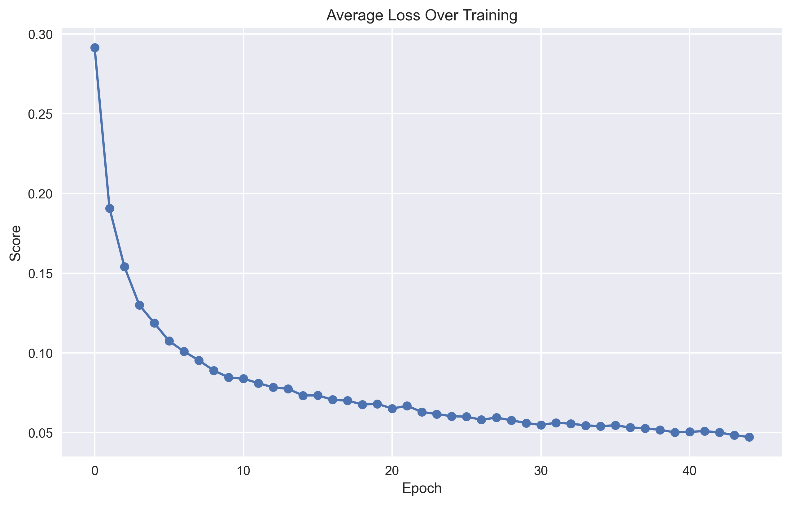
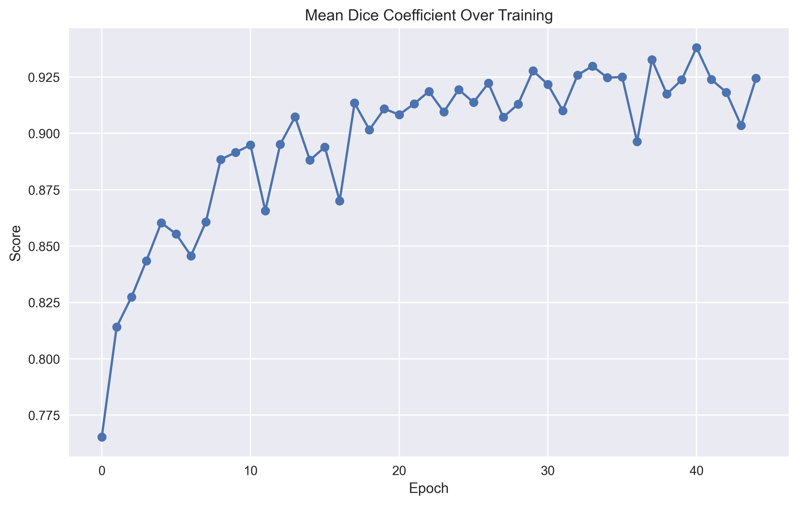

# Chameleon Body Recoloring App

This project is a computer vision application that detects human skin regions, identifies the color of an object being touched by the user's fingertip and dynamically changes the skin color to match the object. It is designed as a learning exercise to explore segmentation, pose estimation, and real-time image processing.

## Features and Progress

- [x] Train a U-Net model for skin segmentation (ignoring clothes and hair) | 2025-05-18
- [ ] Implement fingertip detection using hand landmark tracking  
- [ ] Sample object color at the point of contact  
- [ ] Recolor skin regions in real time while preserving shading  

## U-Net and Segmentation

For this project, I implemented a standard U-Net architecture from scratch. You can find the code in the `unet/` directory.

Since I'm not very experienced building neural networks from scrath I followed a few guides and adjusted the implementation based on what made the most sense to me after testing and tuning. This version of U-Net was influenced by the following excellent resources:

- [PyTorch Image Segmentation Tutorial with U-NET: everything from scratch baby - Aladdin Persson](https://youtu.be/IHq1t7NxS8k?si=d9dofGF9n96192R8)
- [Implement and Train U-NET From Scratch for Image Segmentation - PyTorch - Uygar Kurt)](https://youtu.be/HS3Q_90hnDg?si=6BFVv_jLfQLhuA5i)
- [Dive into Deep Learning – Batch Norm](https://d2l.ai/chapter_convolutional-modern/batch-norm.html)
- [U-NET Paper Walkthrough - Aladdin Persson](https://www.youtube.com/watch?v=oLvmLJkmXuc)

Additionally, I want to acknowledge these four valuable resources for either guiding my approach or providing datasets I used for training and validation:

- [Skinny: Human Skin Detection with U-Net](https://github.com/123mpozzi/skinny?tab=readme-ov-file)
- [visuAAL Skin Segmentation Dataset (Zenodo)](https://zenodo.org/records/6973396)
- [UCI Skin Segmentation Dataset](https://archive.ics.uci.edu/dataset/229/skin+segmentation)
- [ABD Skin Segmentation Dataset](https://github.com/MRE-Lab-UMD/abd-skin-segmentation)

### Training Results

Below are some key results from training:

  
*Average loss per batch across each epoch*

  
*Average Dice coefficient per epoch*

  
*Pixerl accuracy per epoch*

  
*Me vs Me*

### Future Work

I still want to test this system in real-time. At the moment, I don’t have access to a webcam or a machine that allows me to use one for this purpose but it's definitely something I plan to experiment with soon.